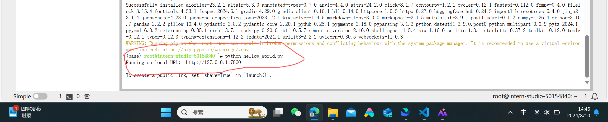

   
# Linux+InternStudio 入门岛通关（1）
  
Hello大家好，今天来到书生大模型实战营，开始书生入门岛通关的闯关操作，在教程的指导下，我登录InternStudio开发机，在Linux服务器上完成相关操作，完成必做关卡任务并打卡后，就会获得当前关卡的算力奖励了，让我开始吧！
  
## 1. 登录InternStudio
  
InternStudio 为开发者提供了一个完整的大模型开发环境，开发者可以在这里进行模型训练、微调、部署等操作。
  
首先打开上面的链接进入[InternStudio] (https://studio.intern-ai.org.cn/)，我已完成注册，现在登录，点击控制台界面，点击启动，如下图所示：

  
现在我已经有了一个开发机，获赠了基础配置，现在点击启动进入开发机，如下图所示：

  
## 2. 进入开发机
进入开发机以后可以看到开发机的主页面，开发机有三种模式可以选择：JupyterLab、终端和VScode
  
我现在进入开发机的JupyterLab模式，分配了24G内存，8G显卡，如下图所示：
 
  
## 3. 建立新文档，安装相关依赖
  
在JupyterLab中命令行中，我新建了一个文档，命名为filename.py，输入以下命令：
```shell
touch filename.py
```
然后右键点击新建的文件，重命名为hello_world.py,按照教程，将相应的代码写入hello_world.py文件中，如下图所示：
```python
  
import socket
import re
import gradio as gr
  
# 获取主机名
def get_hostname():
    hostname = socket.gethostname()
    match = re.search(r'-(\d+)$', hostname)
    name = match.group(1)
  
    return name
  
# 创建 Gradio 界面
with gr.Blocks(gr.themes.Soft()) as demo:
    html_code = f"""
            <p align="center">
            <a href="https://intern-ai.org.cn/home">
                
            </a>
            </p>
            <h1 style="text-align: center;">☁️ Welcome {get_hostname()} user, welcome to the ShuSheng LLM Practical Camp Course!</h1>
            <h2 style="text-align: center;">😀 Let’s go on a journey through ShuSheng Island together.</h2>
            <p align="center">
                <a href="https://github.com/InternLM/Tutorial/blob/camp3">
                    
                </a>
            </p>
  
            """
    gr.Markdown(html_code)
  
demo.launch()
```
## 4. 运行代码
在命令行中输入以下命令：
```shell
python hello_world.py
```
  
系统提示我需要安装gradio，输入以下命令：
```shell
pip install gradio
```
安装完成后，再次运行代码成功，如下图所示：

  
## 5. 端口映射
在我的笔记本电脑上，我已经提取配置好了SSH， 现在打开powerShell，根据教程的指导[Linux+InternStudio 关卡](https://github.com/InternLM/Tutorial/blob/camp3/docs/L0/Linux/readme.md )，输入以下命令：
```shell
  
ssh -p 40567 root@ssh.intern-ai.org.cn -CNg -L 7860:127.0.0.1:7860 -o StrictHostKeyChecking=no -o UserKnownHostsFile=/dev/null
  
```
  

  
运行后，需要输入密码，但因为我已提前配置好SSH， 直接连通，但在powerShell中没有显示
  
直接打开浏览器，输入http://localhost:7860/，可以看到运行的结果，如下图所示：

  
成功运行代码，完成任务，打卡成功，希望获得算力奖励。
  