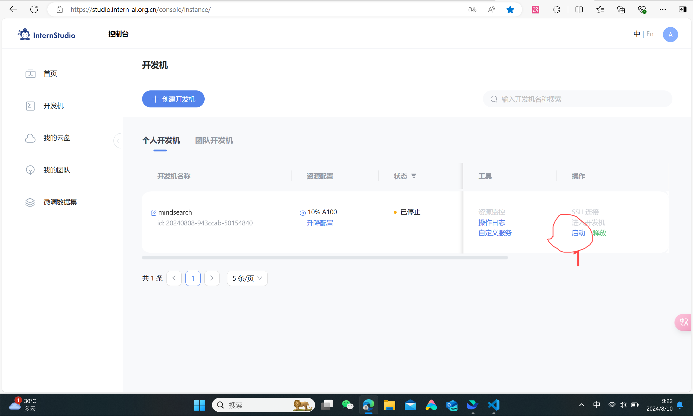

# Python+InternStudio 入门岛通关（2）-1
  
Hello大家好，今天来到书生大模型实战营，开始书生入门岛通关的闯关操作，在教程的指导下，我登录InternStudio开发机，在Linux服务器上完成相关操作，今天完成python课程的task，让我开始吧！
  
## 1. 登录InternStudio
  
InternStudio 为开发者提供了一个完整的大模型开发环境，开发者可以在这里进行模型训练、微调、部署等操作。
  
首先打开上面的链接进入[InternStudio] (https://studio.intern-ai.org.cn/)，我已完成注册，现在登录，点击控制台界面，点击启动，如下图所示：

  
现在我已经有了一个开发机，获赠了基础配置，现在点击启动进入开发机，如下图所示：

  
## 2. 进入开发机
进入开发机以后可以看到开发机的主页面，开发机有三种模式可以选择：JupyterLab、终端和VScode
  
我现在进入开发机的JupyterLab模式，分配了24G内存，8G显卡，如下图所示：
 

## 3. 创建一个Python文件：task_python.py
在JupyterLab中，我点击右上角的New按钮，选择Python3，创建一个Python文件，命名为task_python.py。以下是task_python.py的代码：
```python
import re
from collections import defaultdict

def wordcount(text):
    # Convert text to lowercase
    text = text.lower()
    
    # Use regex to find words
    words = re.findall(r'\b\w+\b', text)
    
    # Initialize a default dictionary to count words
    word_count = defaultdict(int)
    
    # Count each word
    for word in words:
        word_count[word] += 1
    
    return dict(word_count)

# Example usage
input_text = """Got this panda plush toy for my daughter's birthday,
who loves it and takes it everywhere. It's soft and
super cute, and its face has a friendly look. It's
a bit small for what I paid though. I think there
might be other options that are bigger for the
same price. It arrived a day earlier than expected,
so I got to play with it myself before I gave it
to her."""

print(wordcount(input_text))
```

## 4. 运行task_python.py
现在我运行task_python.py，可以看到输出结果如下：
```python
{'got': 1, 'this': 1, 'panda': 1, 'plush': 1, 'toy': 1, 'for': 2, 'my': 2, "daughter's": 1, 'birthday': 1, 'who': 1, 'loves': 1, 'it': 3, 'and': 3, 'takes': 1, 'everywhere': 1, 'soft': 1, 'super': 1, 'cute': 1, 'its': 2, 'face': 1, 'has': 1, 'a': 2, 'friendly': 1, 'look': 1, 'bit': 1, 'small': 1, 'what': 1, 'i': 2, 'paid': 1, 'though': 1, 'think': 1, 'there': 1, 'might': 1, 'be': 1, 'other': 1, 'options': 1, 'are': 1, 'bigger': 1, 'the': 1, 'same': 1, 'price': 1, 'arrived': 1, 'day': 1, 'earlier': 1, 'than': 1, 'expected': 1, 'so': 1, 'got': 1, 'to': 2, 'play': 1, 'with': 1, 'myself': 1, 'before': 1, 'gave': 1, 'her': 1}
```

  
任务完成，我已经成功运行了task_python.py，统计了输入文本中的单词出现次数，现在我可以提交打卡了！