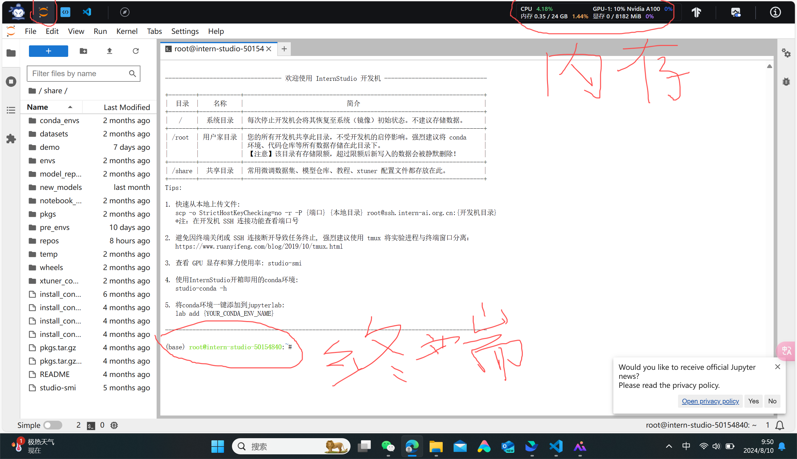

# Python+InternStudio 入门岛通关（2）-2
  
Hello大家好，今天来到书生大模型实战营，开始书生入门岛通关的闯关操作，在教程的指导下，我登录InternStudio开发机，在Linux服务器上完成相关操作，今天计划完成Python课程的第二个作业，让我开始吧！
  
## 1. 登录InternStudio，进入开发机，选择JupyterLab模式
  
InternStudio 为开发者提供了一个完整的大模型开发环境，开发者可以在这里进行模型训练、微调、部署等操作。
  
如前所述，首先打开上面的链接进入[InternStudio] (https://studio.intern-ai.org.cn/)，点击控制台界面，点击启动，进入开发机，现在进入开发机的JupyterLab模式，分配了24G内存，8G显卡，如下图所示：
 

## 2. 创建一个Python文件：task_python.py
在JupyterLab中，创建了task_python.py。以下是task_python.py的代码：
```python
import re
from collections import defaultdict

def wordcount(text):
    # Convert text to lowercase
    text = text.lower()
    
    # Use regex to find words
    words = re.findall(r'\b\w+\b', text)
    
    # Initialize a default dictionary to count words
    word_count = defaultdict(int)
    
    # Count each word
    for word in words:
        word_count[word] += 1
    
    return dict(word_count)

# Example usage
input_text = """Got this panda plush toy for my daughter's birthday,
who loves it and takes it everywhere. It's soft and
super cute, and its face has a friendly look. It's
a bit small for what I paid though. I think there
might be other options that are bigger for the
same price. It arrived a day earlier than expected,
so I got to play with it myself before I gave it
to her."""

print(wordcount(input_text))
```

## 3. 在本地电脑上通过vscode远程登录InternStudio开发机
在本地电脑上，我通过vscode远程登录InternStudio开发机，我此前已在本地电脑上安装了vscode和Remote-SSH插件，我已经通过Remote-SSH，设置好了连接到主机InternStudio开发机，具体参考教程[使用本地Vscode连接InternStudio开发机](https://github.com/InternLM/Tutorial/blob/camp3/docs/L0/Python/readme.md)。现在，在本地电脑上，我打开了vscode，点击左下角打开远程窗口按钮（步骤1），然后选择连接到主机（步骤2），登录到InternStudio开发机，如下图所示：
    

## 4. 在本地电脑上运行task_python.py，并行debug操作
在本地电脑上，我打开了task_python.py文件，点击右上角的Run按钮，运行task_python.py，可以看到输出结果。

## 5. 通过vscode安装远程InternStudio开发机上的插件，如Python插件及Python Debugger插件
在本地电脑上，我通过vscode安装了远程InternStudio开发机上的插件，如Python插件及Python Debugger插件，具体参考教程[使用本地Vscode连接InternStudio开发机](https://github.com/InternLM/Tutorial/blob/camp3/docs/L0/Python/readme.md),如下图所示：
    

## 6. 通过vscode远程调试task_python.py
在本地电脑上，我通过vscode远程调试task_python.py，设置断点，点击左侧的调试按钮，选择Python文件，点击Run and Debug按钮(步骤1，步骤2)，可以看到调试界面。如下图所示：
    

在调试界面，现在task_python.py文件上打断点，然后单步调试，我可以看到变量的值，1表示单步调试，2表示断点，3表示变量的值，如下图所示：
    

 任务完成，我已经成功调试了task_python.py，统计了输入文本中的单词出现次数，现在我可以提交打卡了！